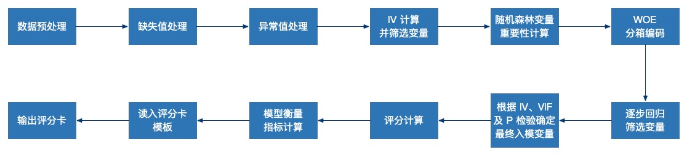

# CreditCard
一套基于`R`并采用[woe](https://github.com/tomasgreif/woe)包的快速构建信用评分卡的代码。

本人转行将近一周年了，最早是从转行后的第一个公司的同事那边拿到这套初版的代码，经过团队里面的不同同事的优化和迭代，不断提高评分卡构建的效率，虽然还是有一些瑕疵，比如前面提到的`woe`包不支持对缺失值进行单独分箱，也无法对类别型变量进行处理，但是易用，而且功能强大，比较适合我们这些不会自己造轮子的同学。

大致的建模流程如下：

包的快速构建信用评分卡的代码。

本人转行将近一周年了，最早是从转行后的第一个公司的同事那边拿到这套初版的代码，经过团队里面的不同同事的优化和迭代，不断提高评分卡构建的效率，虽然还是有一些瑕疵，比如前面提到的`woe`包不支持对缺失值进行单独分箱，也无法对类别型变量进行处理，但是易用，而且功能强大，比较适合我们这些不会自己造轮子的同学。

大致的建模流程如下：

## 项目文件说明
- `service`文件夹：存放主要数据处理和建模的文件
    - `dataCleaning.R`：完成以下主要功能
        - 原始数据导入
        - 异常值删除
        - 缺失值处理
        - 非数值类型变量处理
        - 变量`IV`计算
        - 根据`IV`及随机森林算法得到的变量重要性系数筛选变量，在特征较多的时候可以调整`CRF_BASE`阈值
    - `featureEngineering.R`：完成以下主要功能
        - `WOE`分箱及编码
        - 用逐步回归筛选`WOE`编码后的变量
        - 计算`WOE`单调性并保持图片及数据
        - 保存各个变量的好坏标签的分布图
    - `modeling.R`
        - 确定最终的入模变量
        - 建模并计算评分
        - 计算评估模型评价指标：`KS`、`PSI`等
        - 导入评分卡模板并输出评分卡
    - `modelingtest.R`
        - 通过变量`IV`、个变量间`VIF`、入模变量`P`值显著性等测试入模变量时测试用
- `rawdata`：保存原始数据
    - 关于数据集，这里所采用是著名的数据竞赛网站[kaggle](https://www.kaggle.com/)提供的[GiveMeSomeCredit](https://www.kaggle.com/c/GiveMeSomeCredit/data)数据集
- `util`
    - `udf.R`
        - 自定义的几个函数，主要是绘制`WOE`图并保持相关图片到特定位置
    - `packageManage.R`
        - 管理各种包，特别是需要提前通过`devtools`包`iinstall_github("tomasgreif/riv")`函数安装` WOE`包
- `output`
    - 本文件夹主要保持代码运行过程当中产生的数据文件
- `score_card_template.xlsx`
    - 评分卡模板文件
- `score_card_group_14_KS_0.491+1215_205311.xlsx`
    - 输出的评分卡

## 项目分支
- master
    - 用全量数据构建评分卡
- train_score
    - 用 train 数据集构建评分卡
    

